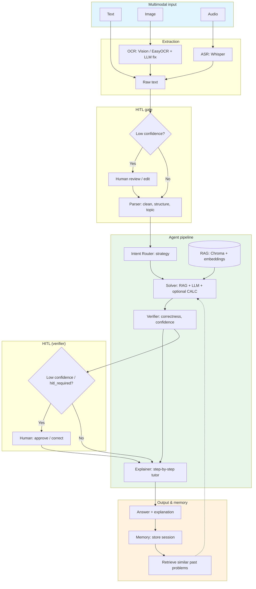

# Math Mentor – Architecture

## High-level flow

## Component summary

| Component | Role |
|-----------|------|
| **OCR** | Image → text (Groq Vision first, EasyOCR + LLM fix fallback). |
| **ASR** | Audio (WAV) → transcript via Whisper. |
| **Parser** | Raw text → structured problem (topic, variables, constraints, needs_clarification). |
| **Intent Router** | Classifies intent (algebra/probability/calculus/linear_algebra), suggests strategy. |
| **RAG** | Chroma + Groq/sentence-transformers embeddings over `knowledge_base/`. Top-k retrieval. |
| **Solver** | Uses RAG context + LLM; optional `CALC: <expr>` for numeric evaluation. |
| **Verifier** | Checks correctness, units, domain; sets confidence and hitl_required. |
| **Explainer** | Turns solution into student-friendly step-by-step explanation. |
| **HITL** | Triggered on low OCR/ASR/verifier confidence or parser ambiguity; user can approve/edit. |
| **Memory** | Stores sessions (input, parsed, context, answer, feedback). Retrieves similar problems for reuse. |

## Repo layout

- **`streamlit_app.py`** – UI; input mode, extraction preview, solve, trace, feedback.
- **`app/config.py`** – Paths, Groq keys, RAG/HITL thresholds.
- **`app/rag.py`** – Build index from `knowledge_base/`, retrieve top-k.
- **`app/embeddings.py`** – Groq embeddings with sentence-transformers fallback.
- **`app/agents/`** – Parser, Router, Solver, Verifier, Explainer.
- **`app/multimodal/ocr.py`** – Vision + EasyOCR. **`app/multimodal/asr.py`** – Whisper.
- **`app/hitl.py`** – `should_trigger_hitl()` conditions.
- **`app/memory.py`** – Store session, retrieve similar.
